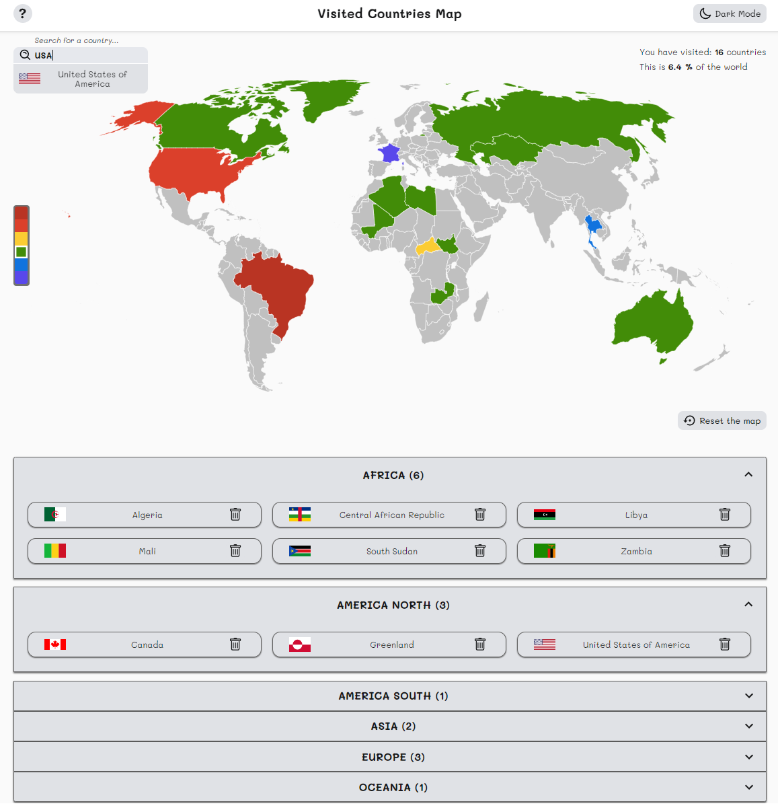

# Visited Countries Map

- Interactive Visited Countries Map app made with React.js and TypeScript for self learning.
- _This is a refactored version of [my first project made with Vanilla JavaScript](https://github.com/tomi5/interactive_visited_countries_map)._

## Demo

Check out the demo! -

## Installation

- Clone this repo to your local machine using `https://github.com/tomi5/tomasz-rysak-cv.git`
- Use yarn to install all dependencies for a project.

```shell
$ yarn install
$ yarn start
```

- Open [http://localhost:3000](http://localhost:3000) to view it in the browser.

## Technologies

- React v16.13.1
- TypeScript
- React Hooks
- Styled Components
- Local Storage
- Rest API
- Material-UI

## Features

Users are be able to:

- Check out how many countries have been visited (with details of the continents as well) and what percetage of the world it is
- Display the visited countries on the map and in the table below.
- Search for a country using an search field typing country's name (in English or in native language)
- Choose between light and dark mode
- Maintain selected both the cisited countries and the theme as well after refreshing the browser
- View the optimal layout depending on their device's screen size

## Screenshots




## Credits and sources

- Country data: [REST Countries API](https://restcountries.eu/)
- Icons: [styled-icons](https://styled-icons.js.org/)
- SVG Map: [Simplemaps.com](http://simplemaps.com)
